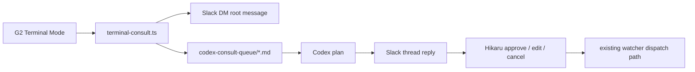

# Terminal Consult Relay

G2 / terminal input を Slack DM と Codex consult queue に中継する最小経路。

## 目的

Even G2 から Slack UI を直接操作するのは現実的ではない。代わりに、G2 Terminal Mode で Codex / Claude terminal に自然文を入れ、その terminal session が次を行う。

1. Hikaru の Slack DM に consult 用 root message を投稿する
2. 同じ内容を `/home/hikaru/projects/hikaru-agent-knowledge/handoff/codex-consult-queue/` に保存する
3. 既存 watcher / Codex plan / approve / executor dispatch 経路に乗せる

この relay は queue 登録だけを行う。Codex review / merge / executor dispatch は自動実行しない。

## Shortcut

G2 からは長いコマンドを打たず、wrapper を使う。

```bash
cd /home/hikaru/projects/claude-code-slack-channel
./scripts/g2-consult.sh "新しい店舗サイトを作りたい。トレカバースを参考にしたい"
```

`~/.local/bin/g2-consult` に symlink すれば、どの directory からでも次で呼べる。

```bash
g2-consult "店頭買取の導線をdevだけで確認したい"
```

## Command

```bash
cd /home/hikaru/projects/claude-code-slack-channel
bun scripts/terminal-consult.ts "新しい店舗サイトを作りたい。トレカバースを参考にしたい"
```

stdin も使える。

```bash
echo "店頭買取の導線をdevだけで確認したい" | bun scripts/terminal-consult.ts
```

## Flow



## Safety

- Slack bot token is read from the existing Slack state dir but never printed.
- Token-like text is redacted before Slack post and before queue write.
- Reserved command-like input (`status?`, `prs?`, `[abort...]`, `approve ...`, `/execute`, `/new-project`, etc.) is rejected by the consult classifier.
- If Slack posting fails, no queue file is written because Codex needs a Slack thread target for plan replies.
- This is not approved dispatch. It only creates a consult request and waits for the existing human gate.

## Operational Notes

Default Slack state dir:

```text
~/.claude/channels/slack
```

Required files in that dir:

```text
inbound-watcher.config.json
.env
```

The command writes queue files to:

```text
/home/hikaru/projects/hikaru-agent-knowledge/handoff/codex-consult-queue/
```

The Slack message includes the generated request id. The queue file uses the same request id and the Slack `ts` as `slack_thread_ts`, so later Codex plan replies can attach to the correct Slack thread.